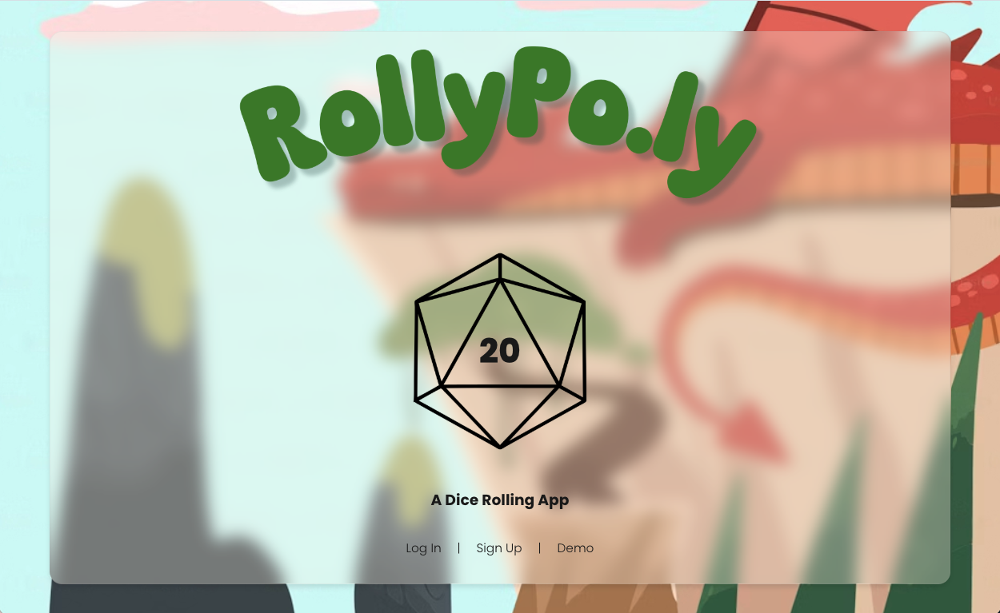
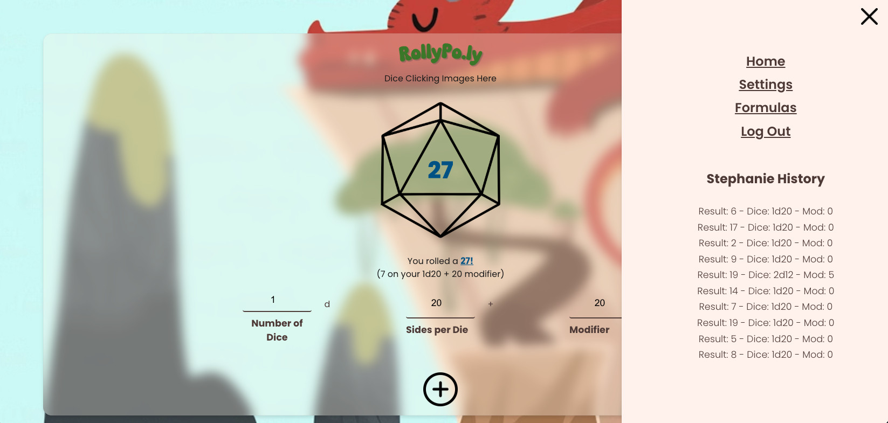
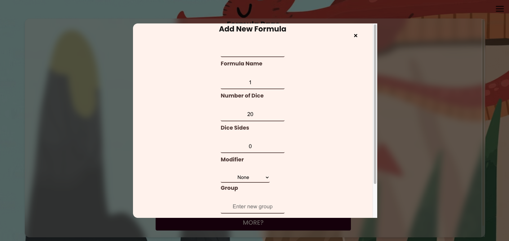

# RollyPo.Ly Dice Roller App

RollPol.ly is a system agnostic dice app for TTRPGs such as *Dungeons & Dragons* and other board games. It allows you to create and categorize your own custom dice formulas so that you don't have to rely on paid services.

## Screenshots

*Landing page screenshot*

*Roller action screenshot*

*Add/Edit Formula screenshot*

## How to Use

1. Go to the [RollyPo.Ly website.](https://rollypolyapp-05daf9d33fc3.herokuapp.com/)
2. Sign up for a free account or try the Demo
3. Edit the number of dice, type of dice, and modifier you'd like to add
4. Click the image of the large dice to roll your fate!
5. Click on the add formula icon to create a preset formula to click on before you roll
6. Access previous rolls via the toggle dropdown menu in the top right

## Technologies Used

- 
- 
- 
- 
- 
- 
- 
- 
- 
- 

*Planning notes available [on Trello](https://trello.com/b/3KeTMMuk/rollypoly)*

## Attribution

Dice icons from Lucas Rathgeb of Noun Project.

## Next Steps
- Add option to remove groups or edit groups
- Add option to color code formula for quick visual reference
- Add ability to change modifier and existing score after roll
- Add advantage/disadvantage and other roll altering options
- Add dynamic Dice Roller image